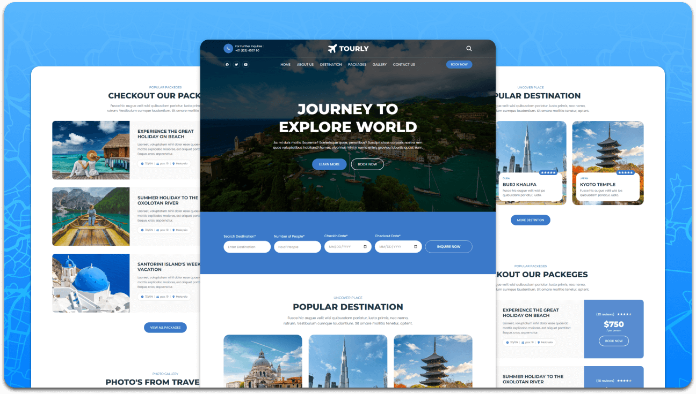

# Tourly - Travel Agency Website

A modern, responsive travel agency website built with HTML, CSS, and JavaScript. Tourly offers an intuitive interface for exploring travel destinations, packages, and booking experiences.

## Features

- **Responsive Design**: Optimized for desktop, tablet, and mobile devices
- **Destination Showcase**: Highlight popular travel destinations with stunning images
- **Package Deals**: Display various travel packages with pricing and details
- **Photo Gallery**: Showcase traveler photos and experiences
- **Interactive Elements**: Search functionality, booking forms, and navigation menu
- **Contact Information**: Easy access to contact details and newsletter signup

## Technologies Used

- **HTML5**: Semantic markup for structure
- **CSS3**: Custom styling with responsive design
- **JavaScript**: Interactive functionality and user experience enhancements

## Screenshots

### Desktop View


### Project Logo


## Getting Started

### Prerequisites

- A modern web browser (Chrome, Firefox, Safari, Edge)
- No server-side dependencies required - this is a static website

### Installation

1. Clone the repository:
   ```bash
   git clone https://github.com/Anjali-sudo397/tourly-master.git
   ```

2. Navigate to the project directory:
   ```bash
   cd tourly-master
   ```

3. Open `index.html` in your web browser or serve it using a local server.

### Running Locally

You can run the website by simply opening the `index.html` file in any modern web browser. For a better development experience, you can use a local server:

- **Using Python** (if installed):
  ```bash
  python -m http.server 8000
  ```
  Then visit `http://localhost:8000`

- **Using Node.js** (if installed):
  ```bash
  npx serve .
  ```

## Project Structure

```
tourly-master/
├── index.html              # Main HTML file
├── assets/
│   ├── css/
│   │   └── style.css       # Main stylesheet
│   ├── js/
│   │   └── script.js       # JavaScript functionality
│   └── images/             # Image assets
│       ├── gallery-*.jpg   # Gallery images
│       ├── popular-*.jpg   # Destination images
│       ├── packege-*.jpg   # Package images
│       ├── hero-banner.jpg # Hero banner
│       ├── logo.svg        # Logo files
│       └── ...
├── readme-images/          # README screenshots
│   ├── desktop.png
│   └── project-logo.png
└── favicon.svg             # Favicon
```

## Contributing

1. Fork the repository
2. Create a feature branch (`git checkout -b feature/AmazingFeature`)
3. Commit your changes (`git commit -m 'Add some AmazingFeature'`)
4. Push to the branch (`git push origin feature/AmazingFeature`)
5. Open a Pull Request

## License

This project is open source and available under the [MIT License](LICENSE).

## Contact

- **GitHub**: [Anjali-sudo397](https://github.com/Anjali-sudo397)
- **Email**: anjaliindian7@gmail.com

---

*Built with ❤️ for travel enthusiasts*</content>
<parameter name="filePath">c:\Users\BIT\Downloads\tourly-master\tourly-master\README.md